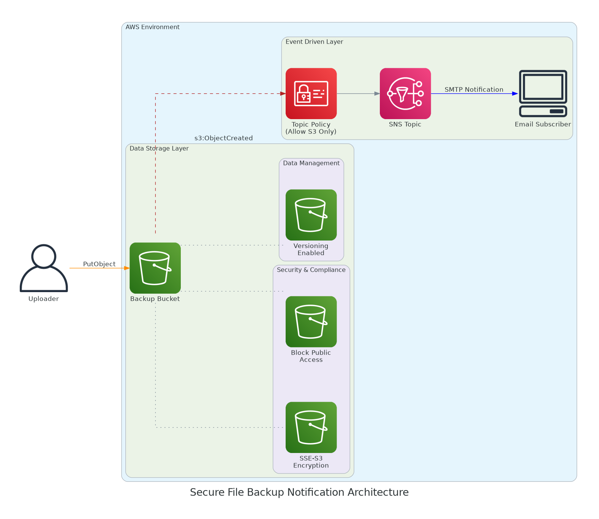

# Simple File Backup Notifications (S3 + SNS)


## 🎯 Overview

Automated notification system that sends real-time email alerts whenever files are uploaded to an Amazon S3 bucket. This project demonstrates a complete **Event-Driven Architecture** implemented through the AWS Console and fully automated with **Terraform/OpenTofu**.

---

## ❗ Problem & Solution

**The Problem:** Manual checks for backup success are inefficient and error-prone. Critical data loss is often discovered too late when visibility is lacking.

**The Solution:** A serverless, event-driven system where **S3 triggers SNS** to deliver instant notifications, ensuring 100% real-time visibility into backup operations.

---

## 🧱 Implementation Using Terraform (IaC) - **Recommended**

This approach fully automates the creation of all AWS resources, ensuring a reproducible and version-controlled infrastructure.

### Resources Created

* **SNS Topic & Policy**: Configured to allow S3 to publish messages.
* **Email Subscription**: Automated alert delivery to specified recipients.
* **S3 Bucket**: Featuring **Versioning**, **SSE-S3 Encryption**, and **Public Access Block**.
* **Event Notifications**: Automatically linked to the SNS Topic.

### Workflow

```bash
tofu init
tofu plan
tofu apply

```

*All customizable values (region, emails, bucket names) are managed via `terraform.tfvars` for easy configuration.*

---

## 🎨 Infrastructure as Diagram (IaD)

### Architecture Automation with Terraform & Python

This project includes a custom Python engine that parses the **Terraform Execution Plan** to generate real-time, faithful architecture diagrams. This ensures that documentation is never outdated.

| Stage | Tool | Action |
| --- | --- | --- |
| **Parsing** | `tofu show -json` | Converts binary plan to a readable `plan.json`. |
| **Intelligence** | Python Script | Maps JSON resources to architectural objects. |
| **Drawing** | `diagrams` library | Renders the final `.png` file. |

#### Why this "Code-First" approach?

* **Granular Control:** Conditional rules allow icons to appear only if features (like *Encryption* or *Lifecycle*) are active in the plan.
* **DevOps Alignment:** Documentation lives inside the code and evolves automatically with the infrastructure.
* **Zero Cost:** A fully open-source and customizable alternative to SaaS tools.

> **Strategic Note:** For large environments, the script is designed to be segmented by **Tags** or **Modules**, avoiding "spaghetti diagrams" and keeping views actionable and clean.

---

## 🛠️ Quick Start (Generate Diagram)

To refresh the architecture diagram based on your current Terraform code:

```bash
# 1. Setup Environment
python3 -m venv venv
source venv/bin/activate
pip install diagrams

# 2. Export Plan & Run Script
tofu plan -out=plan.out
tofu show -json plan.out > plan.json
python diagram/generate_diagram.py

```

---

## 🖥️ Implementation Using AWS GUI (Manual)

<details>
<summary>Click to view manual step-by-step instructions</summary>

1. **SNS Topic:** Create a **Standard** topic named `backup-alerts-gui`.
2. **Subscription:** Create an **Email** subscription and confirm it via your inbox.
3. **S3 Bucket:** Create a bucket and enable **Versioning** and **Default Encryption (SSE-S3)**.
4. **Access Policy:** Update the SNS Topic Access Policy to allow `s3.amazonaws.com` to perform the `sns:Publish` action.
5. **Event Notifications:** Under Bucket Properties, create a notification for `ObjectCreated` pointing to your SNS Topic.

</details>

---

## 🏁 Final Result

* **100% Serverless** & Event-driven.
* **Real-time Notifications** for backup verification.
* **Automated Documentation** that reflects the actual state of the code.

---
